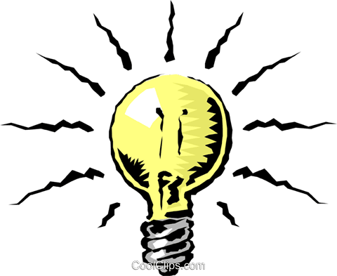

# light
<!--連結 jQuery Mobile -->    
<link rel="stylesheet" href="https://code.jquery.com/mobile/1.4.5/jquery.mobile-1.4.5.min.css">

<!-- 設定Favicon -->
<link rel="shortcut icon" href="image/favicon.ico.ico">
<link rel="bookmark" href="image/favicon.ico.ico">

<title>燈燈的一天</title>
<link rel="stylesheet" href="style.css">
<!-- 主頁 -->

    

        <h1 style='color: rgb(107, 6, 6);'>小燈的一天(首頁)</h1>
        <a href="#aboutus" class="ui-btn ui-corner-all ui-shadow ui-icon-search ui-btn-icon-right">搜索</a>
    
<!-- /header -->

    

        
Hello 我就是顆燈 \(._.)>>

        

        

            <h1>cheese</h1>
            
起司的種類

            

            <h1>藍黴乳酪</h1>
            
是種濃郁的乳酪!

            

            

    
        
 第1頁 

        <a href="#page01" class="ui-btn ui-corner-all ui-icon-carat-r ui-btn-icon-notext" >    第1頁    </a>
        <a href="#aboutus" class="ui-btn ui-icon-info ui-btn-icon-left" data-transition="flip">    關於我們     </a>

    
<!-- /content -->
        
    

        <h4>Copyright &copy; 2020 1108211027@gap.wzu.tw DCAM</h4>
    
<!-- /footer -->

<!-- /page -->

<!-- 第一分頁 -->

    

        <a href="#page00" class="ui-btn ui-corner-all ui-shadow ui-icon-home ui-btn-icon-left">主页</a>
        <h1 style='color: rgb(68, 65, 245);'>小燈的一天 p.1</h1>
        <a href="#aboutus" class="ui-btn ui-corner-all ui-shadow ui-icon-search ui-btn-icon-right">搜索</a>
    
<!-- /header -->

    

        
Good night ~ ~ 要關燈囉囉 ! !  zzz(-"-)zzzzzz

        
        
        
 第2頁 

        <a href="#page02" class="ui-btn ui-corner-all ui-icon-carat-r ui-btn-icon-notext" >    第2頁    </a>
        <a href="#aboutus" class="ui-btn ui-icon-info ui-btn-icon-left" data-transition="flip">    關於我們     </a>

    
<!-- /content -->

    

        <h4>Copyright &copy; 2020 1108211027@gap.wzu.tw DCAM</h4>
    
<!-- /footer -->

<!-- /page -->

<!-- 第二分頁 -->

    

        <a href="#page00" class="ui-btn ui-corner-all ui-shadow ui-icon-home ui-btn-icon-left">主页</a>
        <h1 style='color: rgb(238, 34, 204);'>小燈的一天 p.2</h1>
        <a href="#aboutus" class="ui-btn ui-corner-all ui-shadow ui-icon-search ui-btn-icon-right">搜索</a>
    
<!-- /header -->

    

        
｢ 我不是美食 ! ! m@w@m OMG~ (驚醒)」

        
        
 第1頁

        <a href="#page01" class="ui-btn ui-corner-all ui-icon-carat-l ui-btn-icon-notext">第1頁</a>
        
 第3頁 

        <a href="#page03" class="ui-btn ui-corner-all ui-icon-carat-r ui-btn-icon-notext" >    第3頁    </a>
        <a href="#aboutus" class="ui-btn ui-icon-info ui-btn-icon-left" data-transition="flip">    關於我們     </a>

    
<!-- /content -->

    

        <h4>Copyright &copy; 2020 1108211027@gap.wzu.tw DCAM</h4>
    
<!-- /footer -->

<!-- /page -->

<!-- 第三分頁 -->

    

        <a href="#page00" class="ui-btn ui-corner-all ui-shadow ui-icon-home ui-btn-icon-left">主页</a>
        <h1 style='color: rgb(57, 179, 0);'>小燈的一天 p.3</h1>
        <a href="#aboutus" class="ui-btn ui-corner-all ui-shadow ui-icon-search ui-btn-icon-right">搜索</a>
    
<!-- /header -->

    

        
原來一切都是一場夢(汗... o~o:::

        
        
 第2頁

        <a href="#page02" class="ui-btn ui-corner-all ui-icon-carat-l ui-btn-icon-notext">第2頁</a>
        
 第4頁 

        <a href="#page04" class="ui-btn ui-corner-all ui-icon-carat-r ui-btn-icon-notext" >    第4頁    </a>
        <a href="#aboutus" class="ui-btn ui-icon-info ui-btn-icon-left" data-transition="flip">    關於我們     </a>

    
<!-- /content -->

    

        <h4>Copyright &copy; 2020 1108211027@gap.wzu.tw DCAM</h4>
    
<!-- /footer -->

<!-- /page -->

<!-- 第四分頁 -->

    

        <a href="#page00" class="ui-btn ui-corner-all ui-shadow ui-icon-home ui-btn-icon-left">主页</a>
        <h1 style='color: rgb(255, 148, 86);'>小燈的一天 p.4</h1>
        <a href="#aboutus" class="ui-btn ui-corner-all ui-shadow ui-icon-search ui-btn-icon-right">搜索</a>
    
<!-- /header -->

    

        
來去各地旅遊吧~~

        
        
        
 第3頁

        <a href="#page03" class="ui-btn ui-corner-all ui-icon-carat-l ui-btn-icon-notext">第3頁</a>
        <a href="#aboutus" class="ui-btn ui-icon-info ui-btn-icon-left" data-transition="flip">    關於我們     </a>

    
<!-- /content -->

    <!-- 關於我們 -->
    

 
        

            <h1 style='color: rgb(98, 30, 255);'>關於我們</h1>
        
<!-- /header -->
 
        

            <h1>We are...</h1>
            
Welcome to us... we are........

        
<!-- /content -->
 
        

            <h4>Copyright &copy; 2020 1108211027@gap.wzu.tw DCAM</h4>
        
<!-- /footer -->
 
    
<!-- /page -->

    

        <h4>Copyright &copy; 2020 1108211027@gap.wzu.tw DCAM</h4>
    
<!-- /footer -->

<!-- /page -->
